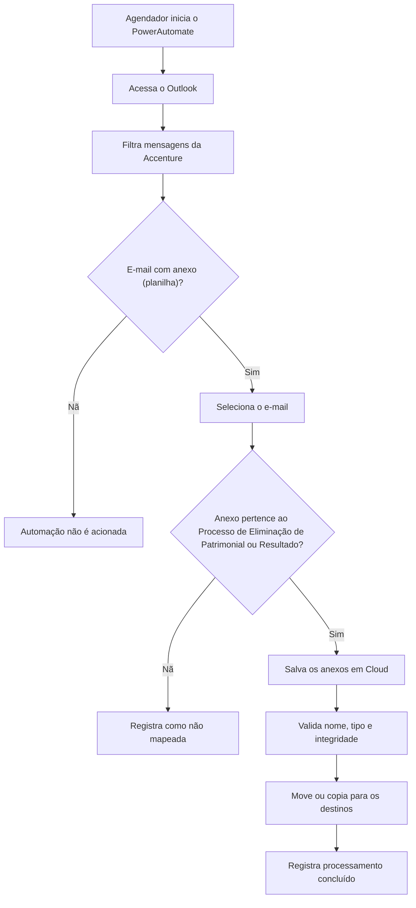

```mermaid
graph TD;
    A["Agendador inicia o PowerAutomate"]-->B["Acessa o Outlook"];
    B-->C["Filtra mensagens da Accenture"];
    C-->D{"E-mail com anexo (planilha)?"};
    D--Não-->E["Automação não é acionada"];
    D--Sim-->F["Seleciona o e-mail"];
    F-->G{"Anexo pertence ao Processo de Eliminação de Patrimonial ou Resultado?"};
    G--Não-->H["Registra como não mapeada"];
    G--Sim-->I["Salva os anexos em Cloud"];
    I-->J["Valida nome, tipo e integridade"];
    J-->K["Move ou copia para os destinos"];
    K-->L["Registra processamento concluído"]
```