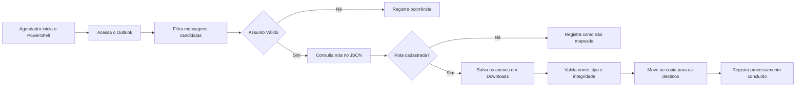

```mermaid
graph LR;
    A["Agendador inicia o PowerShell"]-->B["Acessa o Outlook"];
    B-->C["Filtra mensagens candidatas"];
    C-->D{"Assunto Válido"};
    D--Não-->E["Registra ocorrência"];
    D--Sim-->F["Consulta rota no JSON"];
    F-->G{"Rota cadastrada?"};
    G--Não-->H["Registra como não mapeada"];
    G--Sim-->I["Salva os anexos em Downloads"];
    I-->J["Valida nome, tipo e integridade"];
    J-->K["Move ou copia para os destinos"];
    K-->L["Registra processamento concluído"]
```